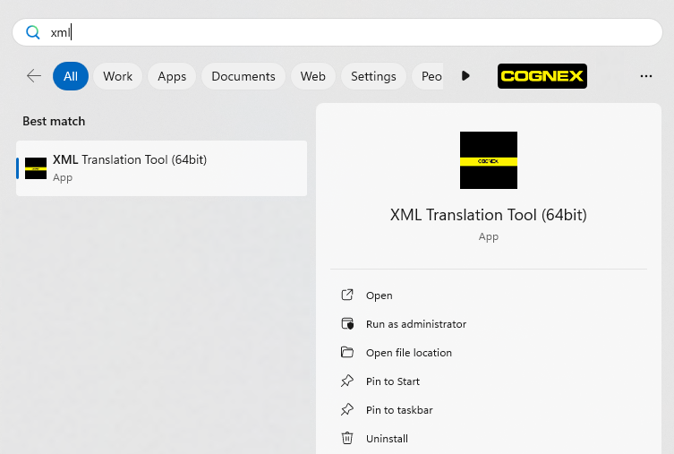

# Cognex Xml Translation Tool

A tool to assist those doing translations for Cognex Corporation.

## Table of Contents

* [About](#about)
* [Installation](#installation)
* [Usage](#usage)

## About

This tool has two purposes. The first is to make it easier on vendors that do translations for Cognex by providing them an application to use. This is to replace the process of directly editing an xml file. The second is to help ensure the Cognex gets the file back in the format needed for internal tooling.

## Installation

### Steps to Download and Install

1. Go to the [releases](https://github.com/CognexExternal/XmlTranslationTool/releases) page
2. Find the latest release, which should be at the top of the page. Click on the "Assets" 
3. Download by clicking on whichever installer (.msi file) you prefer, x86 (32-bit) or x64 (64-bit).
4. Open the msi file on your machine
5. Follow the steps of the installer to install the application.
6. Once installed, open the "Start" menu. If your Windows is set to automatically show recently installed programs, you will see it right away. If not, simply start typing "Xml" and it will appear:

Note: If you later decide you want to uninstall it, you can uninstall it as you would any other program in Windows.

## Usage

1. Open the application
2. Browse to the file the provided to you by Cognex.
3. Press the "Load" button. This will read in the XML file and populate the table below. 
4. Modify the "Translation" column so that it provides an accurate translation. 
5. The "Additional Context" column is intended to be used in two ways: 
    * Cognex adding context to the translation for the translator. 
    * A place for the translator to write a question, save the file, and then send the file back to Cognex for more details.
6. Press the Save (or Save As) button to save your work.
